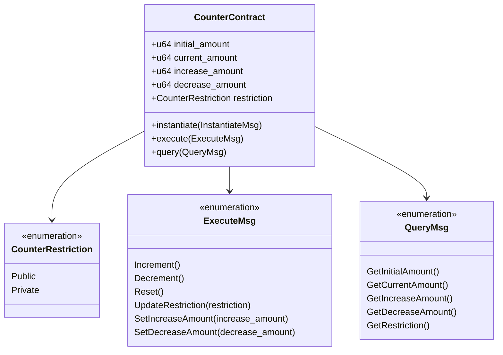

# Andromeda Counter Contract

## Overview

The Andromeda Counter Contract implements a configurable numerical counter with flexible permission controls within the Andromeda protocol ecosystem. This smart contract provides atomic increment, decrement, and reset operations with customizable settings for initial values, step sizes, and access permissions.

## Architecture

The counter maintains several state variables:

- **Initial Amount**: Baseline value the counter resets to
- **Current Amount**: Present value of the counter
- **Increase Amount**: Step size for increment operations
- **Decrease Amount**: Step size for decrement operations
- **Restriction**: Access control setting (Public or Private)



## Access Control

The contract supports two access modes:

- **Public**: Any user can perform counter operations
- **Private**: Only the contract owner or authorized operators can perform counter operations

When in private mode, all counter operations will fail with an **Unauthorized** error if attempted by non-privileged addresses.

## Message Types

### Instantiation

To deploy a new counter, use the following parameters:

```rust
InstantiateMsg {
    kernel_address: String,
    owner: Option<String>,
    restriction: CounterRestriction,
    initial_state: State {
        initial_amount: Option<u64>,
        increase_amount: Option<u64>,
        decrease_amount: Option<u64>,
    },
}
```

The contract applies sensible defaults if optional values are not specified:
- **initial_amount**: 0
- **increase_amount**: 1
- **decrease_amount**: 1

### Execute Messages

The contract supports the following operations:

#### Increment

```rust
ExecuteMsg::Increment {}
```
Increases the current amount by the configured increment value. Returns an error if the operation would cause an overflow.

#### Decrement

```rust
ExecuteMsg::Decrement {}
```
Decreases the current amount by the configured decrement value. The counter implements **saturating subtraction**, meaning it will stop at zero rather than underflowing.

#### Reset

```rust
ExecuteMsg::Reset {}
```
Resets the counter to its initial amount.

#### Update Restriction

```rust
ExecuteMsg::UpdateRestriction { restriction: CounterRestriction }
```
Changes the access restriction for the counter. Only executable by the contract owner.

#### Set Increase Amount

```rust
ExecuteMsg::SetIncreaseAmount { increase_amount: u64 }
```
Updates the increment step size. Only executable by the contract owner.

#### Set Decrease Amount

```rust
ExecuteMsg::SetDecreaseAmount { decrease_amount: u64 }
```
Updates the decrement step size. Only executable by the contract owner.

### Query Messages

#### Get Initial Amount

```rust
QueryMsg::GetInitialAmount {}
```
Returns the initial amount:
```rust
GetInitialAmountResponse { initial_amount: u64 }
```

#### Get Current Amount

```rust
QueryMsg::GetCurrentAmount {}
```
Returns the current counter value:
```rust
GetCurrentAmountResponse { current_amount: u64 }
```

#### Get Increase Amount

```rust
QueryMsg::GetIncreaseAmount {}
```
Returns the increment step size:
```rust
GetIncreaseAmountResponse { increase_amount: u64 }
```

#### Get Decrease Amount

```rust
QueryMsg::GetDecreaseAmount {}
```
Returns the decrement step size:
```rust
GetDecreaseAmountResponse { decrease_amount: u64 }
```

#### Get Restriction

```rust
QueryMsg::GetRestriction {}
```
Returns the current access restriction:
```rust
GetRestrictionResponse { restriction: CounterRestriction }
```

## Error Handling

The contract can return the following errors:

- **Unauthorized**: Occurs when a restricted operation is attempted by an unauthorized user
- **Overflow**: Occurs if incrementing would cause the counter to exceed the maximum u64 value

## Integration Examples

### Creating a Counter with Custom Settings

```rust
// Create a counter with custom settings
let msg = InstantiateMsg {
    kernel_address: "andromeda_kernel".to_string(),
    owner: Some("owner_address".to_string()),
    restriction: CounterRestriction::Public,
    initial_state: State {
        initial_amount: Some(100),
        increase_amount: Some(5),
        decrease_amount: Some(10),
    },
};
```

### Interacting with the Counter

```rust
// Increment the counter
let increment_msg = ExecuteMsg::Increment {};

// Decrement the counter
let decrement_msg = ExecuteMsg::Decrement {};

// Reset the counter
let reset_msg = ExecuteMsg::Reset {};

// Make the counter private
let update_restriction_msg = ExecuteMsg::UpdateRestriction {
    restriction: CounterRestriction::Private,
};

// Change the increment step size
let set_increase_msg = ExecuteMsg::SetIncreaseAmount {
    increase_amount: 20,
};
```

## Event Attributes

The contract emits events with the following attributes on successful operations:

### Increment

```
"action": "Increment"
"sender": <address>
"current_amount": <new_value>
```

### Decrement

```
"action": "Decrement"
"sender": <address>
"current_amount": <new_value>
```

### Reset

```
"action": "Reset"
"sender": <address>
"current_amount": <reset_value>
```

### Update Restriction

```
"action": "UpdateRestriction"
"sender": <address>
```

### Set Increase Amount

```
"action": "SetIncreaseAmount"
"sender": <address>
"increase_amount": <new_value>
```

### Set Decrease Amount

```
"action": "SetDecreaseAmount"
"sender": <address>
"decrease_amount": <new_value>
```

## Testing Suite

The contract includes comprehensive unit and integration tests that verify:

- Proper initialization with default and custom values
- Access control enforcement for private counters
- Increment and decrement operations with overflow/underflow handling
- Reset functionality
- Permission-controlled configuration changes
- Event attribute emission

## Technical Details

- **Language**: Rust
- **Framework**: CosmWasm
- **Storage**: Uses `cw_storage_plus` for state management
- **Version**: 0.1.0-a.2
- **Authors**: Mitar Djakovic

## Build Commands

The contract includes the following Cargo aliases for convenience:

```
cargo wasm           # Build the WebAssembly binary
cargo unit-test      # Run unit tests
cargo schema         # Generate JSON schema files
```

## License

This contract is part of the Andromeda protocol. Please refer to the project's license for usage terms.
